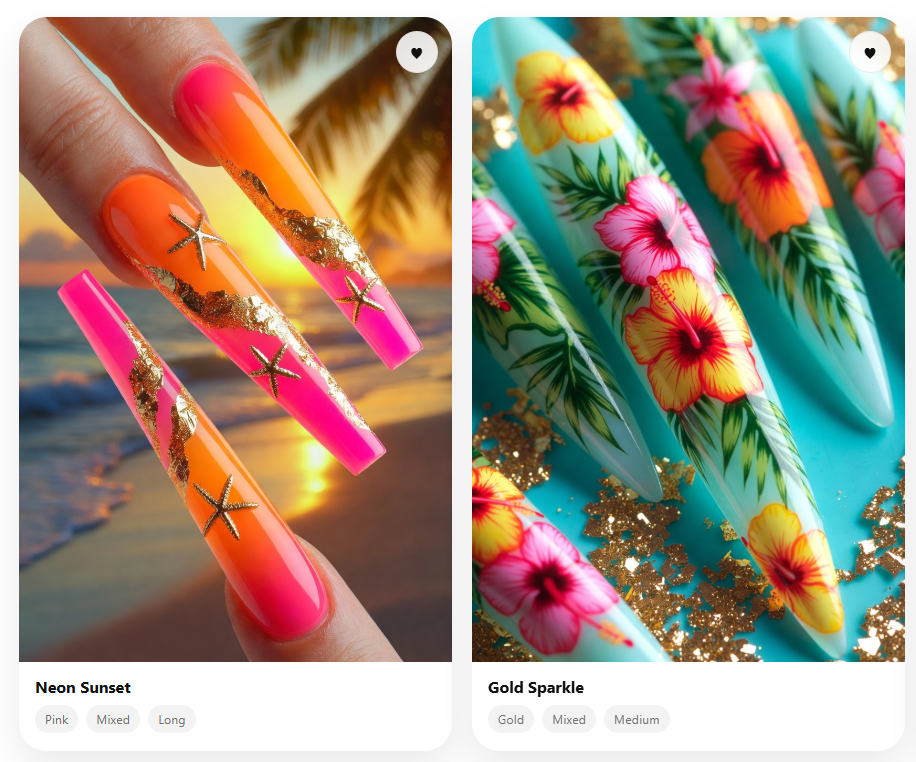

# Set 💅✨  
### A visual nail inspiration app for finding, saving, and organizing your next manicure idea.

Set is a clean, Pinterest-style nail inspiration gallery designed to help users quickly find the exact nail look they want before an appointment. Instead of endlessly scrolling through random photos, users can browse by style, color, shape, length, and vibe.



---

## ✨ What Set Does

- Browse nail designs in a visual gallery
- Filter looks by color, shape, and length
- Save favorite designs with a heart button
- Organize inspiration before a nail appointment
- View designs in a clean, minimal layout
- Store saved favorites locally using `localStorage`

---

## 🖼️ App Style

Set is designed to feel:

**Soft • Minimal • Feminine • Clean • Visual • Modern**

The layout is inspired by beauty moodboards, nail salon prep, and Pinterest-style browsing. The goal is to make choosing a nail design faster, prettier, and less overwhelming.

---

## 🛠️ Built With

- HTML
- CSS
- JavaScript
- LocalStorage
- Image gallery filtering
- Responsive card layout

---

## 💡 Why I Made It

I created Set because people often know the general vibe they want for their nails, but freeze when it’s time to choose a design. This app helps users collect options, narrow them down, and walk into their appointment with a clear idea.

---

## 📌 Current Features

| Feature | Status |
|---|---|
| Nail gallery | ✅ Working |
| Category filters | ✅ Working |
| Favorite/save button | ✅ Working |
| Saved designs board | ✅ Working |
| LocalStorage support | ✅ Working |
| Mobile-friendly layout | In progress |

---

## 🚧 Future Improvements

- Search bar for specific nail styles
- More filters by occasion, season, and design detail
- Saved inspiration boards
- Upload your own nail inspiration
- AI “Help Me Choose” feature
- Appointment-prep moodboard export

---

## 🌸 Project Vision

Set is the beginning of a larger nail inspiration platform: a better, faster, more specific way to find nail designs than scrolling through general image apps.

The long-term goal is to help users search by exact details like:

- “short red almond nails”
- “birthday chrome nails”
- “simple vacation nails”
- “pink coquette nails”
- “Halloween stiletto nails”

---

## 📍 Live Preview

Run locally with:

```bash
python -m http.server 8000
```
